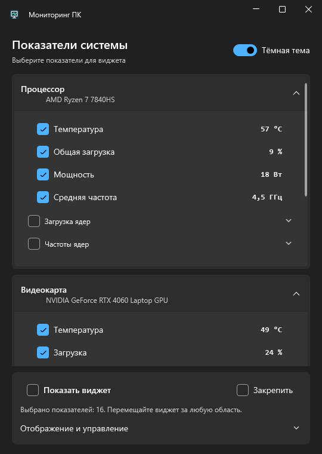
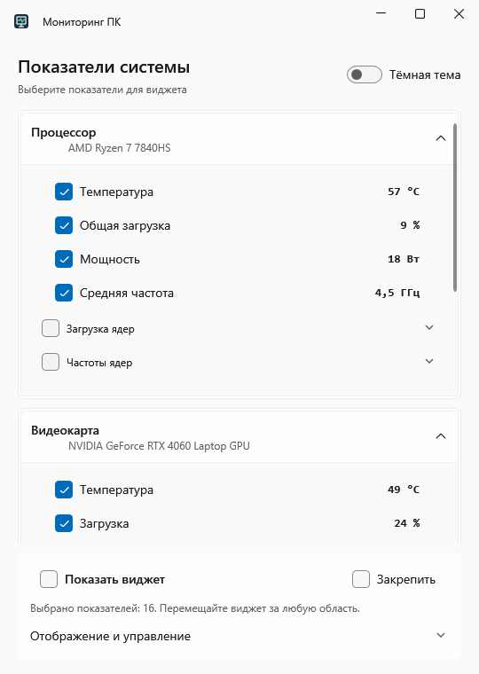
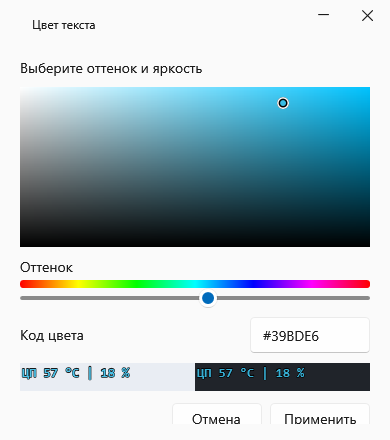
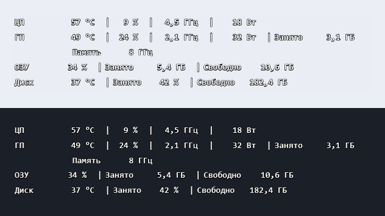

# Мониторинг ПК

[](https://github.com/YOUR_LOGIN/HardwareMonitor/actions/workflows/windows-ci.yml)

Перед публикацией замените `YOUR_LOGIN` в ссылках значка на свой GitHub-логин. Проверки запускаются после первого push; в приватном репозитории значок может быть недоступен без авторизации.

Небольшое русскоязычное приложение для наблюдения за состоянием компьютера во время игры или работы. Отметьте показатели флажками и включите прозрачный текстовый виджет поверх окон: без фоновой панели и оформления, отвлекающего от основного занятия.

## Возможности

- Температура, загрузка, частота и мощность процессора/видеокарты; дополнительные температуры, отдельные ядра и видеопамять.
- Занятая и доступная оперативная память, температура и заполненность накопителей, свободный объём и обороты вентиляторов при наличии датчиков.
- Главная строка каждого устройства и выбранные подробности строго под ней; моноширинные числа, постоянные колонки и размер текста 12–20. Обновление показаний не меняет размер виджета.
- Полная цветовая палитра с предпросмотром, прозрачность букв и обводки, лёгкая обводка по желанию.
- Перемещение, закрепление с пропуском щелчков, горячие клавиши, работа в трее и автосохранение настроек.
- Температурные индикаторы, минимум/максимум за сеанс, диагностика исходных датчиков. Светлая и тёмная тема главного окна.

## Интерфейс

Демонстрационные показания на снимках не являются результатами аппаратной проверки AMD. [Виджет с подробностями по ядрам и видеокарте](Screenshots/overlay-details.png).

[Настройки отображения](Screenshots/appearance.png).

| Тёмная тема | Светлая тема |
| --- | --- |
|  |  |

| Выбор любого цвета | Только текст поверх изображения |
| --- | --- |
|  |  |

## Запуск

Нужны Windows 10/11 и .NET SDK 8+ для сборки, либо .NET Desktop Runtime 8 для запуска готовой версии.

```powershell
dotnet restore
dotnet build -c Release --no-restore -warnaserror
dotnet test -c Release --no-build --no-restore
& ./HardwareMonitor/bin/Release/net8.0-windows/HardwareMonitor.exe
```

Запускайте `.exe`: манифест запрашивает административные права через UAC. Закрытие главного окна убирает приложение в трей; «Выход» в трее завершает опрос и освобождает ресурсы.

1. Отметьте нужные показатели флажками.
2. В «Отображение и управление» нажмите образец текущего цвета. Выберите оттенок ползунком и цвет в поле палитры; виджет обновляется сразу. «Отмена» возвращает прежний цвет.
3. При желании измените прозрачность текста, размер и обводку.
4. Включите «Показать виджет». Для перемещения снимите «Закрепить».

Выбор, цвет, прозрачность, размер текста, тема, горячие клавиши и положение сохраняются в `%LOCALAPPDATA%/HardwareMonitor/settings.json`. Подробности ядер управляются только флажками датчиков. Незакреплённый виджет перемещается за всю внутреннюю область: служебный альфа-канал 1/255 позволяет Windows захватывать мышь в пустых местах, без видимой фоновой панели. При закреплении он полностью прозрачен. Виджет после запуска включается вручную.

## Датчики и PawnIO

Оборудование опрашивает [LibreHardwareMonitor](https://github.com/LibreHardwareMonitor/LibreHardwareMonitor). Поддержаны варианты Intel/AMD, разные видеокарты и вложенные устройства; доступность метрик зависит от модели, прошивки и драйверов. Для низкоуровневых датчиков процессора/платы необходим штатно установленный подписанный [PawnIO](https://pawnio.eu/). NuGet-пакет не устанавливает системный драйвер. После установки PawnIO полностью перезапустите приложение.

`—` означает отсутствие данных, NaN или невозможное значение. Настоящий ноль, например у остановленного вентилятора, сохраняется. В диагностике доступны исходные имена, идентификаторы, типы, значения и состояние доступа к драйверу. Если общего датчика частоты процессора нет, средняя частота рассчитывается по показаниям ядер; отсутствующее показание не подменяется нулём.

## Температурные индикаторы

Жёлтый `!` означает повышенную, красный — высокую температуру. Место для знака зарезервировано: текст не сдвигается. Индикатор меняется после трёх последовательных показаний; обратное переключение имеет запас 3 °C, чтобы избежать мерцания.

| Датчик | Повышенная / высокая, °C |
| --- | --- |
| Процессор и его ядра | 85 / 95 |
| Видеоядро | 80 / 90 |
| Максимальная температура видеокарты, видеопамять | 95 / 105 |
| Накопитель | 60 / 70 |

Это консервативные ориентиры для внимания к охлаждению, а не пределы производителя и не диагноз неисправности. Допустимая температура зависит от конкретной модели. Остановка вентилятора сама по себе не вызывает тревогу: возможен штатный режим без вращения.

## Стек и проверки

C#, .NET 8, WPF, WPF-UI, CommunityToolkit.Mvvm, LibreHardwareMonitorLib 0.9.6. Палитра и векторная обводка реализованы средствами WPF. Опрос идёт в отдельном последовательном цикле с рекурсивным обновлением устройств.

`dotnet test` запускает 12 сценариев NUnit: существующие проверки сохранены, включая 155 утверждений логики и WPF, дополнительно проверяется завершение опроса. Аппаратные данные Intel/AMD моделируются; тесты не требуют PawnIO. [GitHub Actions](.github/workflows/windows-ci.yml) на Windows выполняет восстановление зависимостей, Release-сборку с предупреждениями как ошибками и тесты при push и pull request.

Дополнительные проверки на реальном ПК выполняются отдельно, вне CI:

```powershell
dotnet run --project HardwareMonitor.Tests -c Release -- --ui
dotnet run --project HardwareMonitor.Tests -c Release -- --smoke
```

Проверки охватывают Intel/AMD, вложенные устройства, отсутствующие значения, настройки, горячие клавиши, настоящую отрисовку цвета/прозрачности и постоянный размер строк. Для реального аппаратного отчёта из повышенного терминала:

```powershell
& ./HardwareMonitor.Tests/bin/Release/net8.0-windows/HardwareMonitor.Tests.exe --probe --output .artifacts/report.json
```

## Ограничения

- Intel Core i3-14100F и NVIDIA GeForce RTX 5060 проверены на текущем ПК с PawnIO 2.2.0; конкретный AMD-ноутбук требует аппаратной проверки. Отсутствующие датчики приложение не заменяет выдуманными значениями.
- В обычных и безрамочных окнах виджет работает поверх содержимого; эксклюзивный полноэкранный режим игр не гарантируется.
- Размер меняется при изменении выбранного набора, а не при опросе. Большой набор разбивается на заранее определённые строки; большое количество выбранных ядер увеличивает высоту.
- Нет измерения времени кадров. Непроверенные напряжения и активность дисков остаются в диагностике. Частота видеопамяти показывается по библиотеке, без пересчёта в скорость передачи данных.

## Планы

Аппаратная проверка большего числа AMD-ноутбуков и сочетаний мониторов с разным масштабом; уточнение температурных ориентиров по доступным данным конкретной модели.

[Публикация и готовая сборка](docs/GITHUB.md) · [Проверка на ноутбуке](docs/LAPTOP_CHECKLIST.md) · [Полный список файлов](docs/REPOSITORY_MANIFEST.md) · [Результаты проверки](CHANGES.md) · [История](CHANGELOG.md)
